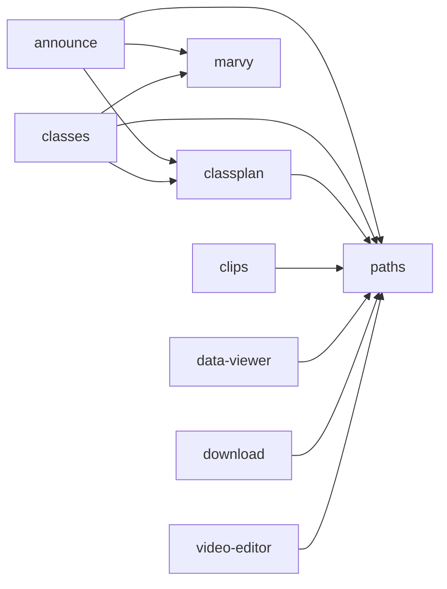

# Dependency Graph

## Table

| From | To | Type | Detail |
|------|----|------|--------|
| [announce](announce/index.md) | [classplan](classplan/index.md) | python_import | cross-project import |
| [announce](announce/index.md) | [marvy](marvy/index.md) | python_import | cross-project import |
| [announce](announce/index.md) | [paths](paths/index.md) | python_import | cross-project import |
| [classes](classes/index.md) | [classplan](classplan/index.md) | python_import | cross-project import |
| [classes](classes/index.md) | [marvy](marvy/index.md) | python_import | cross-project import |
| [classes](classes/index.md) | [paths](paths/index.md) | python_import | cross-project import |
| [classplan](classplan/index.md) | [paths](paths/index.md) | python_import | cross-project import |
| [clips](clips/index.md) | [paths](paths/index.md) | python_import | cross-project import |
| [data-viewer](data-viewer/index.md) | [paths](paths/index.md) | python_import | cross-project import |
| [download](download/index.md) | [paths](paths/index.md) | python_import | cross-project import |
| [video-editor](video-editor/index.md) | [paths](paths/index.md) | python_import | cross-project import |

## Diagram

